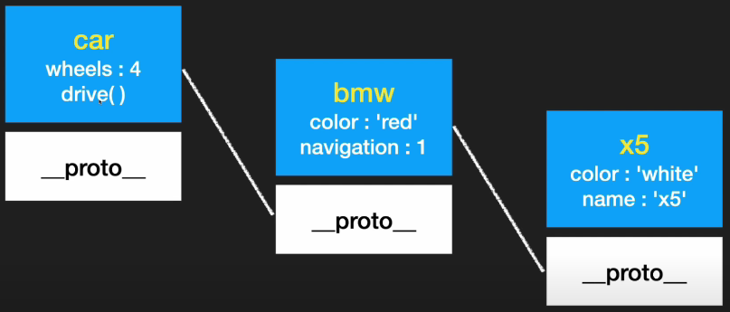

# 상속, 프로토타입 

## 프로토타입의 동작을 이해해보자.
```js 
// 예시 1
const user = {
    name: 'Mike'
}

> user.name 
<- "Mike"

> user.hasOwnProperty('name')
<- true 

> user.hasOwnProperty('age')
<- false
```
`hasOwnProperty`함수는 현재 객체에 해당 속성이 있으면 `true`, 없으면 `false`를 리턴하고 있다. 

이때 user에 대해 `hasOwnProperty`라는 함수를 작성한 적이 없는데, 실행이 가능하다. 어디서 온 것일까? 

콘솔에서 `user`를 입력하면, 아래와 같은 정보를 확인할 수 있는데, `__proto__`라는 내용이 보인다. 

`__proto__`는 프로토타입이라는 객체이다. 
```js
// 콘솔창 
> user 
<- {name: "Mike"}
    > __proto__: Object
```

만약 `user`에 `hasOwnProperty`라는 함수를 아래와 같이 직접 작성했다고 하자. 
```js 
// 예시 2
const user = {
    name: 'Mike',
    hasOwnProperty: function(){
        console.log('haha')
    }
}

user.hasOwnProperty() 
// haha를 출력한다. 
```

이때는 아까처럼 TF가 아닌 직접 작성한 함수의 내용이 실행된다. 

**즉, 해당 객체에 해당 프로퍼티가 있다면 거기서 탐색을 멈추고, 없을 때만 `__proto__` 프로토타입에서 프로퍼티를 찾는다.**

프로토타입의 동작 이해를 위해 또 다른 예제를 살펴보자.

```js
// 예시 3
const bmw = {
    color: 'red',
    wheels: 4, 
    navigation: 1, 
    drive(){
        console.log('drive..');
    }
}
const benz = {
    color: 'black',
    wheels: 4, 
    drive(){
        console.log('drive..');
    }
}
const audi = {
    color: 'blue',
    wheels: 4, 
    drive(){
        console.log('drive..');
    }
}
```

위와 같이 자동차 객체를 선언한다고 할 때, 차들이 늘어나면, 계속 새로운 변수로 만들어줘야 한다. 이때 공통된 부분들은 어떻게 해결할 수 있을까?

이를 해결하기 위해 `__proto__`을 사용할 수 있다. 아래와 같이 말이다. 

```js
// 예시 3-1
const car = {
    wheels:4, 
    drive(){
        console.log('drive..');
    }
}

const bmw = {
    color: 'red',
    navigation: 1, 
}
const benz = {
    color: 'black',
}
const audi = {
    color: 'blue',
}

bmw.__proto__ = car; 
benz.__proto__ = car; 
audi.__proto__ = car; 
```

공통된 부분들은 `car`로 묶어 선언하고, 

**맨 마지막에 각 객체의 `__proto__`를 `car`로 설정하면 된다.**

**다르게 말하면, `bmw`는 `car`의 상속을 받는 것이다.**

만약, console창에 `bmw.wheels`를 작성해보자. 4가 나온다. 근데 `bmw`만 쳐보면 color와 navigation 속성만 보인다. 이는 즉, `wheels` 속성을 bmw 안에서 찾고, 있으면 탐색을 멈춘다. 없으면, `__proto_-`로 가서 찾아 값을 리턴한다. 

---
### 상속의 연속성 
**또한 상속은 계속 이어질 수 있다.**
아래의 예제를 확인해보자. 

```js
// 예시 3-2
const car = {
    wheels:4, 
    drive(){
        console.log('drive..');
    }
}

const bmw = {
    color: 'red',
    navigation: 1, 
}

bmw.__proto__ = car; 

const x5 = {
    color: 'white',
    name: 'x5'
}
x5.__proto__ = bmw; 
```


위의 사진처럼, x5에서 속성을 찾고, 없으면 bmw, 없으면 car로 순차적으로 올라가며 속성을 찾는다. 

**이를 `prototype chain`이라고 한다.**

---
```js
// 예시 3-3 (콘솔창)
for (p in x5){
    console.log(p);
} // color, name, navigation, wheels, drive 5개를 출력한다.

> x5
<- {color: 'white', name: 'x5'}

// 상속된 프로퍼티는 나오지 않는다. 

Object.keys(x5);
//["color", "name"]

Object.values(x5);
// ["white", "x5"]

for (p in x5){
    if(x5.hasOwnProperty(p)){
        console.log('o', p);
    }
    else{
        console.log('x', p);
    }
}
/**실행결과
 * 
 * o color
 * o name
 * x navigation 
 * x wheels 
 * x drive
 * 
 * 위처럼 `hasOwnProperty`를 활용하면, 객체 자체가 갖고 있는 것인지 알려준다. 
 * /
```

---
### 객체 생성 시 
이는 객체를 생성할 때도 사용할 수 있다. 

```js
const car = {
    wheels:4, 
    drive(){
        console.log('drive..');
    }
}

const Bmw = function (color){
    this.color = color; 
}

const x5 = new Bmw('red');
const z4 = new Bmw('blue');

x5.__proto__ = car; 
z4.__proto__ = car; 
```

근데 매번 `__proto__`를 지정해주는 일도 번거롭다. 이를 아래처럼 수정해주면, 한번에 x5, z4까지 정의가 가능하다.  

```js
// const car = {
//     wheels:4, 
//     drive(){
//         console.log('drive..');
//     }
// }

const Bmw = function (color){
    this.color = color; 
}
Bmw.prototype.wheels = 4;
Bmw.prototype.drive = function(){
    console.log("drive..");
}
Bmw.prototype.navigation = 1; 
Bmw.prototype.stop = function(){
    console.log('stop');
}
const x5 = new Bmw('red');
const z4 = new Bmw('blue');

// x5.__proto__ = car; 
// z4.__proto__ = car; 
```
이때 이 부분은 
```js 
Bmw.prototype.wheels = 4;
Bmw.prototype.drive = function(){
    console.log("drive..");
}
```
생성자 함수가, 생성자 객체에, prototype.(속성) = (값); 이렇게 설정한다는 뜻이다. 

이렇듯 프로토타입을 활용하면 중복코드를 줄일 수 있다. 

---
## instanceof
생성자 함수가 새로운 객체를 만들어낼 때, 그 객체는 생성자의 `instance(인스턴스)`라고 불려진다. 

이를 편리하게 확인하기 위해, `instanceof()`라는 함수를 제공한다. 

특정 생성자로부터 만들어진 객체인지 확인하고, 맞다면 `true`, 아니라면 `false`를 리턴한다. 

예를 들어 `z4`에 대해 테스트해보자. 

```js
z4.instanceof Bmw 
// true 

z4.constructor === Bmw; 
// true 
```

이때 `constructor`는 z4 객체의 프로퍼티로 생성자를 가리킨다. 


위의 코드를 좀 더 가독성 높여보고자 아래 코드에서 주석 처리한 것처럼 작성할 수도 있지만, `z4.constructor === Bmw`의 결과 값이 `false`가 나오게 된다. 이는 혼동을 야기할 수 있으므로 따라서, prototype을 덮어쓰지 말고, 따로따로 하나씩 작성하는 것이 올바른 방식이다. 


```js
const Bmw = function (color){
    this.color = color; 
}
// Bmw.prototype = {
//     wheels: 4,
//     drive(){
//         console.log('drive..');
//     },
//     navigation: 1,
//     stop(){
//         console.log('stop');
//     }
// }
const x5 = new Bmw('red');
const z4 = new Bmw('blue');

```
---
### 프로퍼티 값 수정 막기 
```js
const Bmw = function (color){
    const c = color; 

    this.getColor = function (){
        console.log(c);
    }
}

const x5 = new Bmw("red");
```

위와 같이 하면 값을 가져올 수만 있고, 값의 수정을 막을 수 있다. 