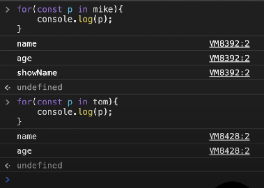
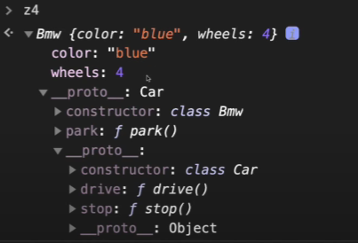
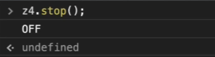
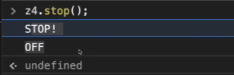

<!-- TOC -->
# 목차 

- [클래스 Class](#%ED%81%B4%EB%9E%98%EC%8A%A4-class)
    - [생성자 함수 VS 클래스 차이점](#%EC%83%9D%EC%84%B1%EC%9E%90-%ED%95%A8%EC%88%98-vs-%ED%81%B4%EB%9E%98%EC%8A%A4-%EC%B0%A8%EC%9D%B4%EC%A0%90)
        - [new 동작](#new-%EB%8F%99%EC%9E%91)
        - [for-in문 동작](#for-in%EB%AC%B8-%EB%8F%99%EC%9E%91)
    - [클래스의 상속: extends 키워드](#%ED%81%B4%EB%9E%98%EC%8A%A4%EC%9D%98-%EC%83%81%EC%86%8D-extends-%ED%82%A4%EC%9B%8C%EB%93%9C)
    - [메소드 오버라이딩 method overriding](#%EB%A9%94%EC%86%8C%EB%93%9C-%EC%98%A4%EB%B2%84%EB%9D%BC%EC%9D%B4%EB%94%A9-method-overriding)
    - [생성자 오버라이딩 overriding](#%EC%83%9D%EC%84%B1%EC%9E%90-%EC%98%A4%EB%B2%84%EB%9D%BC%EC%9D%B4%EB%94%A9-overriding)
        - [자식 클래스에 생성자가 없을 때 동작 원리](#%EC%9E%90%EC%8B%9D-%ED%81%B4%EB%9E%98%EC%8A%A4%EC%97%90-%EC%83%9D%EC%84%B1%EC%9E%90%EA%B0%80-%EC%97%86%EC%9D%84-%EB%95%8C-%EB%8F%99%EC%9E%91-%EC%9B%90%EB%A6%AC)

<!-- /TOC -->

# 클래스 Class 

지금까지 비슷한 객체를 생성하기 위해 `생성자 함수`를 사용해 왔었다.

`Class`는 `ES 6`에 추가된 스펙이다.

아래의 예제를 통해서 생성자 함수를 사용할 떄와 클래스를 사용했을 때를 살펴보자. 

```js
const User = function (name, age){
    this.name = name; 
    this.age = age;
    // // 객체 자체에 저장된다. 
    // this.showName = function(){
    //     console.log(this.name);
    // }
}
// 이렇게 작성하면, User2와 동일하게 프로토타입으로 선언할 수 있다. 
User.prototype.showName = function(){
    console.log(this.name);
}
// mike은 객체 내부에 showName()이 저장되어있고
const mike = new User('Mike', 30);

class User2{
    // 생성자 함수 
    constructor (name, age){
        this.name = name; 
        this.age = age;
    }
    // showName: User2의 __proto__에 저장된다. 
    showName(){
        console.log(this.name);
    }
}

// tom은 프로토타입 내부에 showName()이 저장되어 있다. 
const tom = new User2("Tom", 19);
```

### new 동작 
생성자 함수의 경우 `const mike = User("Mike", 30);`으로 `new`를 빼고 실행해도 에러가 발생하지 않는다. 분명히 개발자가 실수한 코드지만 동작한다. 

클래스의 경우, `const tom = User2("Tom", 19);`와 같이 `new`를 빼고 작성하게 되면 `Uncaught TypeError: Class` 에러가 발생하게 된다. 
즉, 클래스는 `new`없이 객체 생성이 불가능하다. 

### for-in문 동작 

아래와 같이 for-in문을 콘솔창에서 돌렸을 때 



생성자 함수로 생성된 객체에 대해서는, 
for-in문은 프로토타입이 포함된 프로퍼티를 다 보여주고, 객체가 가지고 있는 프로퍼티만 판별하기 위해서 `hasOnProperty`를 사용해야 한다. 

클래스의 메서드는 for-in문에서 제외된다. 즉, constructor 내부에 선언된 속성만 보여진다는 점이 다른 점이다. 

## 클래스의 상속: extends 키워드 

아래와 같이 Car라는 객체를 이용해 상속에 대해 알아보자. 

```js
// extends 

class Car{
    constructor(color){
        this.colro = color; 
        this.wheels = 4; 
    }
    drive(){
        console.log("drive..");
    }
    stop(){
        console.log("STOP!");
    }
}

class Bmw extends Car{
    park(){
        console.log("PARK");
    }
}

const z4 = new Bmw("blue");
```
위와 같을 때 z4를 확인해보자. 
아래의 사진과 같이 확인할 수 있다. 



z4를 확인해봤을 때, 우선적으로 첫번째 프로토타입에서 `Bmw` 함수만 확인 가능하다. 두번쨰 프로토타입을 확인해보면 `Car` 클래스의 함수들이 확인 가능하다.

앞서 배웠던 것처럼, 현재 객체 내부에 없으면 참조하고 있는 상위 객체의 속성을 확인해본다는 점을 상기하면 좋을 것 같다. 

## 메소드 오버라이딩 method overriding

```js 
// extends 

class Car{
    constructor(color){
        this.colro = color; 
        this.wheels = 4; 
    }
    drive(){
        console.log("drive..");
    }
    stop(){
        console.log("STOP!");
    }
}

class Bmw extends Car{
    park(){
        console.log("PARK");
    }

    // !!!!!! POINT 
    stop(){
        console.log("OFF!");
    }
}

const z4 = new Bmw("blue");
```

위와 같이 **부모 메소드를 재작성하게 되면**, 재작성한 함수가 실행된다. 아래에서 확인 가능하듯 말이다. 



만약, **부모의 메소드를 유지하면서 확장하고 싶다**면, `super`라는 키워드를 아래처럼 사용할 수 있다. 이런 방식을 `메소드 오버라이딩`이라고 한다. 

```js
class Bmw extends Car{
    park(){
        console.log("PARK");
    }

    // !!!!!! POINT 
    stop(){
        super.stop(); 
        console.log("OFF!");
    }
}
```
이때의 실행결과는 다음과 같다. 




## 생성자 오버라이딩 (overriding)

앞서 작성한 Bmw 클래스에서 Car의 생성자를 오버라이딩해보자. 

- 일반적인 클래스의 경우(extends를 사용하지 않고 작성한 클래스)
  - 생성자에서 `super`키워드 사용하지 않아도 된다. 
- extends를 만들어서 생성된 자식 클래스의 경우 
  - 생성자는 부모의 메소드를 확장해 작성하고자 한다면 반드시 `super`라는 키워드를 사용해야 한다.  
  - 또한 부모와 동일한 매개변수를 가져야 한다. 


```js
// extends 

class Car{
    constructor(color){
        this.colro = color; 
        this.wheels = 4; 
    }
    drive(){
        console.log("drive..");
    }
    stop(){
        console.log("STOP!");
    }
}

class Bmw extends Car{
    // !!!!!! POINT 
    constructor(color){
        super(color); 
        this.navigation = 1; 
    }
    park(){
        console.log("PARK");
    }
}

const z4 = new Bmw("blue");
```

### 자식 클래스에 생성자가 없을 때 동작 원리

아래의 상황처럼 자식 클래스에 생성자가 작성되지 않았을 때 어떻게 동작할까? 

```js 
// extends 

class Car{
    constructor(color){
        this.colro = color; 
        this.wheels = 4; 
    }
    drive(){
        console.log("drive..");
    }
    stop(){
        console.log("STOP!");
    }
}

class Bmw extends Car{
    // 이 부분이 있는 것처럼 동작하는 것이다. 
    // constructor(...args){
    //     super(...args);
    // }
    park(){
        console.log("PARK");
    }
}

const z4 = new Bmw("blue");
```

**즉, 자식 클래스는 부모 생성자를 무조건 호출하도록 설계된 것이다.**

**따라서, 생성자 함수를 오버라이딩 할 때 반드시 `super()`를 실행해줘야하는 이유인 것이다.**