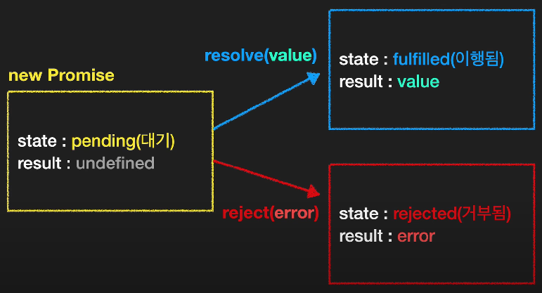

# Promise 프로미스 

## 프로미스 동작원리 이해하기 

프로미스를 이해하기 위해 일상에서의 예를 살펴보자. 

상점(A)과 소비자(B)가 있다고 해보자.

A의 상황은 아래와 같다. 
- 상품이 만들어지는 시간 간격이 일정하지 않다. 
- 떄로는 상품이 잘못 만들어져 FAIL인 경우, 다시 주문해야 한다.
- 상품이 완성되었을 때 OK라는 신호를 보낸다. 

B는 A에게서 물건을 구매하려고 한다면, 10초 간격으로 물어보는 방법이 있다. 
B는 대기하면서 10초마다 연락을 취하고, A의 응답이 OK라고 할때까지 대기해야 한다. 

이 방식은 보다 효율적이지 못하다. 

B는 A에게 연락처를 알려두고, A는 이 번호를 기억해둔다. 
A가 작업이 완료되었거나, 작업이 실패했을 때 연락할 수 있도록 하면 B는 그 시간 동안 다른 일을 할 수 있다. 

이 방식이 보다 효율적인데,

이때 이런 연락을 취할 수 있도록 하는 도구가 `프로미스`이다. 

### 프로미스 선언 
프로미스는 아래와 같이 사용할 수 있다. 

이때 함수를 전달받는데, 인수는 resolve와 reject이다. 
- resolve는 성공한 경우, reject는 실패한 경우 실행되는 함수이다.

이처럼 어떤 일이 완료된 이후 실행되는 함수를 `callback`함수라고 한다. 

```js 
const pr = new Promise((resolve, reject) => {
    // code
})
```

### 판매자: new Promise()

`new Promise`가 반환하는 프로미스 객체는 **`state`와 `result`**를 프로퍼티로 갖는다. 이때 `state: pending(대기)/ result: undefined` 값을 갖는다. 

**만약 실행이 성공하였다면,** 

`resolve(value)`함수가 실행되며, 
- `state: fulfilled(이행됨)` 값으로 바뀌고,
- 인자로 전달받은 value는 `result: value` 값을 갖는다. 
- <예시- 판매자(상점)>
    ```js 
    // 판매자의 코드 
    const pr = new Promise((resolve, reject) => {
      setTimeout(()=>{
          resolve('OK'); //result는 'OK'값을 갖는다. 
      }, 3000); // 3초 뒤에 성공 함수가 실행된다.
    });
    ```

**만약 실행이 실패했다면,** 

`reject(error)` 함수가 실행되며,
- `state: rejected(거부됨)` 값으로 바뀌고, 
- 인자로 전달받은 error는 `result:error` 값이 된다. 
- <예시- 판매자(상점)>
  ```js 
    const pr = new Promise((resolve, reject) => {
      setTimeout(()=>{
          reject(new Error('error...'));
      }, 3000); // 3초 뒤에 실패 함수가 실행된다.
    })
    ```


[출처: 코딩앙마]
 
### 소비자: then문
소비자의 경우, `then` 키워드를 활용한다. 

- `function(result)함수` 
  - 성공 실행시 실행되는 함수 
  - result = resolve함수의 인수값 'OK'가 들어온다.
- `function(err)함수` 
  - 거부(실패) 되었을 때 실행되는 함수
  - error에는 에러 값이 들어온다. 


```js

// 판매자의 코드 
const pr = new Promise((resolve, reject) => {
    setTimeout(()=>{
        resolve('OK'); //result는 'OK'값을 갖는다. 
    }, 3000); // 3초 뒤에 성공 함수가 실행된다.
});


// 소비자의 코드 => !! then !! 을 이용한다. 
pr.then(
    function(result){
        console.log(result + ' 가지러 가자.');
    }, 
    function(err){ 
        // 위의 코드에서 reject 함수가 없으므로 실제 실행되지는 않을 것이다. 
        console.log('다시 주문해주세요..');
    } 
);
```


### 소비자: then-catch문

```js
const pr = new Promise((resolve, reject) => {
    setTimeout(()=>{
        resolve('OK');  
    }, 3000); 
});

pr.then(
    function(result){}, 
    function(err){} 
);
```

이때, 아래와 같이 `then`을 대신해 `then-catch`문을 활용할 수 있다. 

```js
const pr = new Promise((resolve, reject) => {
    setTimeout(()=>{
        resolve('OK');  
    }, 3000); 
});

pr.then(
    function(result){}
).catch(
    function(err){} 
).finally(
    function(){}
)
```

가독성이 좋고 `then` 함수를 실행하다가 발생한 오류 또한 잡아줄 수 있다. 

추가적으로 `finally`는 이행이 되든, 거부되었든 무조건 실행되는 함수이다.(swtich문의 default 같은)

```js 
// 실제 예시 
pr.then(
    function(result){
        console.log(result + ' 가지러 가자.');
    }.catch(
        function(err){
            console.log('다시 주문해주세요..');
        } 
    ).finally(
        function(){
            console.log('---주문 끝---');
        }
    )
);
```

### 예시 
```js
const f1 = () => {
    return new Promise((res, rej) => {
        setTimeout(() => {
            res('1th order complete.');
        }, 1000);
    });
};
const f2 = (message) => {
    console.log(message);
    return new Promise((res, rej) => {
        setTimeout(() => {
            res('2rd order complete.');
        }, 3000);
    });
};
const f3 = (message) => {
    console.log(message);
    return new Promise((res, rej) => {
        setTimeout(() => {
            res('3rd order complete.');
        }, 2000);
    });
};

f1()
.then((res)=>f2(res))
.then((res)=>f3(res))
.then((res)=>console.log(res))
.catch(console.log);
```