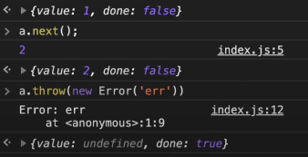

# Generator 

함수의 실행을 중간에 멈췄다가 재개할 수 있는 기능 

- 함수 선언 시, `*` 을 function뒤에 붙여 작성한다. => `function*`
- 함수 내부에서 `yield` 키워드를 이용하며, yield 위치에서 멈출수 있다. 
- 제너레이터 함수 실행 시, `제너레이터 객체`가 반환된다. 이때 함수의 본문코드는 바로 실행되지 않으며, 객체만 리턴한다. 
 
 
## 제너레이터 객체가 갖는 함수 
### 1. next()
- `객체.next()`를 실행하게 되면, 가장 가까운 `yield`를 만날 때까지 함수가 실행되고, **데이터 객체**를 반환하며 해당 yield문에서 실행이 중단된다. 
- **데이터 객체**: `{value, done}`으로 구성된다. 
 - value: `yield` 오른쪽에 있는 값을 의미한다. 값 생략 시 undefined이다.
 - done: 함수 코드가 끝났는지 나타낸다. 실행이 끝나면 true, 아니면 false 값을 갖는다. 
- next() 예시 
```js 
function* fn(){
    console.log(1);
    yield 1; 
    console.log(2);
    yield 2; 
    console.log(3);
    console.log(4);
    yield 3; 
    return "finish";
}
const a = fn();

for(var i=0; i<4; i++){
    console.log('---');
    var data = a.next();
    console.log(data);
}
```

실행결과 
```
---
1
{ value: 1, done: false }
---
2
{ value: 2, done: false }
---
3
4
{ value: 3, done: false }
---
{ value: 'finish', done: true }
```

### 2. return()

a.next()를 호출하다가, `a.return(val)`를 호출하게 되면 그 즉시 함수 실행을 중단한다. 즉 반환된 데이터 객체는 `{value: val, done: true}` 값을 갖는다. 이후에 next()를 실행해도, value를 얻어올 수 없다. 

```js
function* fn(){
    console.log(1);
    yield 1; 
    console.log(2);
    yield 2; 
    console.log(3);
    console.log(4);
    yield 3; 
    return "finish";
}
const a = fn();

for(var i=0; i<4; i++){
    console.log('---');
    var data;
    if (i == 2){
        data = a.return('end');
    }else{
        data = a.next();
    }
    console.log(data);
}
```

실행결과 
```
---
1
{ value: 1, done: false }
---
2
{ value: 2, done: false }
---
{ value: 'end', done: true }
---
{ value: undefined, done: true }
```

### 3. throw()
제너레이터 객체에 에러를 던지는 함수로, return과 같이 반횐되는 데이터 객체에서 `done:true`로 만든다.

```js
function* fn(){
    try{
        console.log(1);
        yield 1; 
        console.log(2);
        yield 2; 
        console.log(3);
        console.log(4);
        yield 3; 
        return "finish";
    } catch(e){
        console.log(e);
    }    
}
const a = fn();
```

위와 같이 try-catch문으로 에러를 잡도록 하고, 
`a.next()`를 2번 호출 후, `a.throw(new Error('err'))`하면 
아래와 같은 실행결과를 볼 수 있다. 



## iterable, iterator 

- iterable
  - Symbol.iterator 메소드가 있다. 
  - Symbol.iterator는 iterator를 반환해야 한다. 
(iterable한 객체는 for문 let-of가 가능하다. )

- iterator 
  - next 메소드를 가진다. 
  - next 메소드는 value와 done 속성을 가진 객체를 반환한다. 
  - 작업이 끝나면 done은 true가 된다. 

따라서 제너레이터는 iterator를 가지고 있기 때문에 iterable하다.
즉, 반복가능하다.

- 배열, 문자열도 iterable하다.

```js 
/**** 배열 ****/
const arr = [1,2,3,4,5];
// arr는 Symbol.iterator 메서드를 갖는다. 

const it = arr[Symbol.iterator](); 
// arr의 Symbol.iterator 메소드를 실행한 결과값을 it에 넣는다. 

console.log(it.next());
console.log(it.next());
console.log(it.next());
console.log(it.next());
console.log(it.next());
console.log(it.next());

// 실행결과
// { value: 1, done: false }
// { value: 2, done: false }
// { value: 3, done: false }
// { value: 4, done: false }
// { value: 5, done: false }
// { value: undefined, done: true }

/** 문자열 **/
const str = "hello";
const xx = str[Symbol.iterator]();

console.log(xx.next());
console.log(xx.next());
console.log(xx.next());

// 실행결과 
// { value: 'h', done: false }
// { value: 'e', done: false }
// { value: 'l', done: false }

for (let s of xx){
    console.log(s); // h, e, l, l, o 순차적으로 출력한다. 
}
```

제너레이터로 다시 돌아오면, 

```js 
function* fn(){
    yield 4;
    yield 5;
    yield 6;
}

const a = fn();

// 제너레이터 a의 iterator를 실행한 결과가 자기 자신과 같다.
console.log(a[Symbol.iterator]() === a); // true

for (let num of a){
    console.log(num); // 4, 5, 6 순차적으로 출력한다.
}
```


## next()에 인수 전달 
- 제너레이터는 외부로부터 값을 입력받을 수 있다. 

```js
function* fn(){
    const num1 = yield "1번째 숫자를 입력해주세요";
    console.log(num1);
    const num2 = yield "2번째 숫자를 입력해주세요";
    console.log(num2);

    return num1 + num2; 
}

const a = fn();

console.log(a.next());
console.log(a.next(1));
console.log(a.next(2));

```

실행결과 
```
{ value: '1번째 숫자를 입력해주세요', done: false }
1
{ value: '2번째 숫자를 입력해주세요', done: false }
2
{ value: 3, done: true }
```

## 값을 미리 만들어 두지 않는다. 
제너레이터는 값을 미리 만들어 두지 않는다. 
`객체.next()`가 호출되었을 때만, 제너레이터가 값을 만들기 때문에 

아래와 같이 무한반복문을 작성해도 브라우저가 뻗지 않는다.

따라서 필요한 순간 순간에만 값을 증가시킬 수 있다. 

```js
function* fn(){
    let index = 0; 
    while (true){
        yield index++;
    }
}
const a = fn();

console.log(a.next()); // 0
console.log(a.next()); // 1
console.log(a.next()); // 2
```

## `yield*`를 이용한다.

yield* 옆에는 iterable한 모든 객체가 올 수 있다. 

```js 
function* gen1(){
    yield 'w';
    yield 'o';
    yield 'r';
    yield 'l';
    yield 'd';
}
function* gen2(){
    yield 'Hello,';
    yield* gen1(); 
    yield '!';
}

console.log(...gen2()); // Hello, W o r l d !
// ... 은 반복가능한 객체를 let-of 처럼 done:true가 될때까지 펼쳐놓는 역할을 한다. 
```

## 정리: 제너레이터는 다른 작업을 하다가 다시 돌아와서 next()해주면 진행이 멈췄던 부분부터 이어서 실행한다. -> Redux Saga에서 활발하게 사용가능한 것.